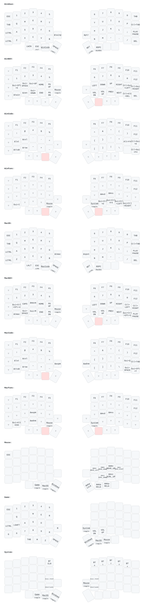

# Lily58 Wireless ZMK Config

此倉庫為 Lily58 無線鍵盤的 ZMK 設定，包含多層 keymap、無線設定與 GitHub Actions CI 自動化建置流程。

鍵盤圖片

<div style="width: 80%; margin: auto;">
  
  
  
</div>

## 專案結構

- `config/`: 主要設定（`lily58.keymap`、`lily58.conf`、`west.yml`）。
- `IMG/`: 鍵盤/佈局相關圖片資產。
- `.github/workflows/`: CI 建置流程。
- `build.yaml`: CI 建置矩陣（左右半部與顯示模組）。

## 功能特色

- 多層鍵盤映射：支援 Windows / macOS / 遊戲等層。
- 無線配置：支援 Nice!Nano V2 與 Nice!View 顯示模組。
- 省電：深度睡眠，預設 30 分鐘後進入。
- ZMK Studio：支援即時 Keymap 更新（左側以 USB-UART Snippet）。
- CI 自動化：透過 GitHub Actions 自動建置並產出左右半部的 `zmk.uf2` 韌體。

## 使用 GitHub Actions 取得韌體

本專案已設定 GitHub Actions CI，每當你推送（Push）變更或發起 Pull Request 時，系統會自動依照 `build.yaml` 的矩陣設定編譯韌體。

1. **推送到倉庫**：將修改後的 `config/lily58.keymap` 或其他設定推送到 GitHub。
2. **前往 Actions 頁面**：進入你的 GitHub 倉庫頁面，點選上方的 **Actions** 分頁。
3. **下載 Artifacts**：點開最新一次成功執行（Green Check）的工作流程，在頁面下方找到 **Artifacts** 區塊，即可下載包含左右半部韌體的壓縮檔（內含 `zmk.uf2`）。
4. **燒錄韌體**：將下載解壓縮後的 `zmk.uf2` 分別燒錄到左右半部的 Nice!Nano V2。

## 本機開發與除錯（選用）

若需要在本機測試建置（需先安裝好 ZMK 開發環境）：

初始化 ZMK 工作區（於此倉庫根目錄）：
```bash
west init -l config
west update

# 本機建置指令範例（含 Nice!View 與 ZMK Studio）：

# 左半部
west build -p=auto -d build/left  -b nice_nano_v2 -- \
  -DSHIELD="lily58_left nice_view_adapter nice_view" \
  -DSNIPPET=studio-rpc-usb-uart

# 右半部
west build -p=auto -d build/right -b nice_nano_v2 -- \
  -DSHIELD="lily58_right nice_view_adapter nice_view"
```

## ZMK Studio（可選）


- 設定已於 config/lily58.conf:19 啟用 CONFIG_ZMK_STUDIO=y 並解鎖。

- 左半部建置時加入 -DSNIPPET=studio-rpc-usb-uart（CI 已自動處理），以 USB 連線使用 Studio。

- 右半部通常不需要加入該 Snippet。

## 測試與 CI

- 確認推送到 GitHub 後，CI 可以成功建置並產出 zmk.uf2。

- 重大變更請附 keymap 差異或對照圖（可放於 IMG/）。

- 請勿提交產物與私密資料（build/、.uf2、序號/金鑰）。

## 藍牙與系統層

- 於 SYS 層可清除配對與選擇插槽：bt BT_CLR、bt BT_SEL 0..4。

- 進入 Bootloader 與系統重啟：bootloader、sys_reset。

- 相關配置可參考 config/lily58.keymap 的 SYS_layer。

## AGENTS 指南摘要

- 結構與資產：config/ 放置主要設定；IMG/ 放置圖片；建置矩陣由 build.yaml 管理。

- 風格規範：YAML 與 .keymap/.conf 皆採 2 空白縮排；層名稱全大寫（如 BASE、NAV）；.conf 僅使用既有 CONFIG_ 開關。

- 測試要求：確保 CI 順利建置產生 zmk.uf2；重大變更提供新舊層級對照或 keymap 差異。

- 提交規範：建議使用 Conventional Commits；PR 需附變更摘要、影響層級、截圖/IMG/ 圖片（如有）。

- 安全注意：勿提交產物與私密資料；變更 west.yml 或 build.yaml 前，確認 CI 矩陣仍涵蓋左右半部與顯示模組。

- 完整細節請參見 AGENTS.md。
## 貢獻

- 建議採用 Conventional Commits（如 ci:、build:、refactor:）。

- 送 PR 前，請確認 GitHub Actions CI 能夠正常通過。

授權

此專案採用 MIT 授權，詳見 LICENSE.md。
