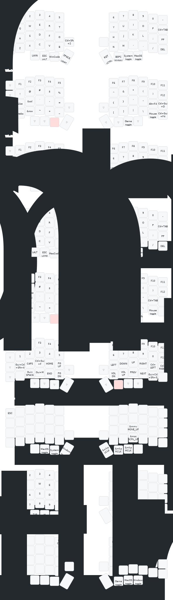

# Lily58 Wireless ZMK Config

此倉庫為 Lily58 無線鍵盤的 ZMK 設定，包含多層 keymap、無線設定與 CI 建置流程。

## 專案結構

- `config/`: 主要設定（`lily58.keymap`、`lily58.conf`、`west.yml`）。
- `IMG/`: 鍵盤/佈局相關圖片資產。
- `.github/workflows/`: CI 建置流程。
- `build.yaml`: CI 建置矩陣（左右半部與顯示模組）。

## 功能特色

- 多層鍵盤映射：支援 Windows / macOS / 遊戲等層。
- 無線配置：支援 Nice!Nano V2 與 Nice!View 顯示模組。
- 省電：深度睡眠，預設 30 分鐘後進入。
- CI 自動化：GitHub Actions 產出左右半部韌體。

## 建置與使用

1) 初始化 ZMK 工作區（於此倉庫根目錄）：

```bash
west init -l config
west update
```

2) 本機建置左右半部（輸出位於 `build/<side>/zephyr/zmk.uf2`）：

```bash
west build -d build/left  -b nice_nano_v2 -- -DSHIELD=lily58_left
west build -d build/right -b nice_nano_v2 -- -DSHIELD=lily58_right
```

3) 將產生之 `zmk.uf2` 分別燒錄到左右半部的 Nice!Nano V2。

4) 依需求調整 `config/lily58.keymap` 與 `config/lily58.conf`，重新建置驗證。

## 測試與 CI

- 確認左右半部皆可成功建置並產生 `zmk.uf2`。
- 重大變更請附 keymap 差異或對照圖（可放於 `IMG/`）。
- CI 會依 `build.yaml` 定義的矩陣建置左右半部與顯示模組。
- 請勿提交產物與私密資料（`build/`、`.uf2`、序號/金鑰）。

## AGENTS 指南摘要

- 結構與資產：`config/` 放置主要設定；`IMG/` 放置圖片；建置矩陣由 `build.yaml` 管理。
- 建置指令：初始化 `west init -l config && west update`；左右半部分別以 `west build -d build/<side> -b nice_nano_v2 -- -DSHIELD=lily58_<side>` 建置；常用 `-p=auto` 進行乾淨重建。
- 風格規範：YAML 與 `.keymap`/`.conf` 皆採 2 空白縮排；層名稱全大寫（如 `BASE`、`NAV`）；`.conf` 僅使用既有 `CONFIG_` 開關。
- 測試要求：左右半部皆需成功建置產生 `zmk.uf2`；重大變更提供新舊層級對照或 keymap 差異。
- 提交規範：建議使用 Conventional Commits；PR 需附變更摘要、影響層級、截圖/`IMG/` 圖片（如有）、本機建置結果與重現指令。
- 安全注意：勿提交產物與私密資料；變更 `west.yml` 或 `build.yaml` 前，確認 CI 矩陣仍涵蓋左右半部與顯示模組。

完整細節請參見 `AGENTS.md`。

## 鍵盤圖片

<div style="width: 80%; margin: auto;">
  
  
  
</div>

## 貢獻

- 建議採用 Conventional Commits（如 `ci:`、`build:`、`refactor:`）。
- 送 PR 前，請先於本機完成左右半部建置並附上重現指令。
- 詳見貢獻與風格規範：`AGENTS.md`。

## 授權

此專案採用 MIT 授權，詳見 `LICENSE.md`。
